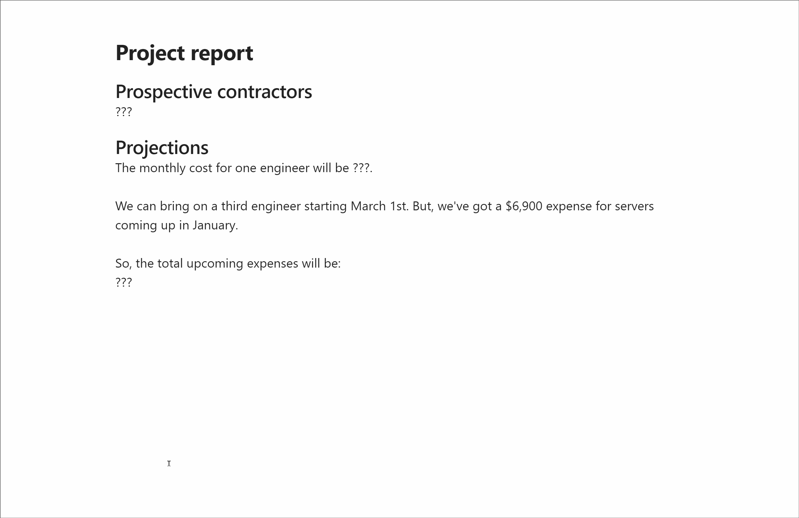

# Interactivity Plugin for Obsidian

Sometimes you need to compute numbers or access data while writing your notes. It's handy to do this without leaving the [Obsidian](https://github.com/obsidianmd/obsidian-releases) workspace, using your favorite tools like Python, Perl, Node.js, or others.
For example, if you need to quickly calculate a project's budget while taking notes, you can type the numbers and hit Enter in your Obsidian note to execute the code in the desired REPL:
```plaintext
## Mike's rate is $120. Thus, it will cost us:
@120*8*21*12+8000
249920
```

This plugin allows you to run shell commands and scripts directly within your notes, providing their output right alongside your written content, making your note-taking process more dynamic and interactive.
By default, it supports running JavaScript, but you can also configure it to run any other shell commands.

You can trigger shell execution in two ways:

1. Text Patterns from Notes: Define specific text patterns in your notes that will trigger shell execution when encountered. For example, you can use shortcuts like `@2+2` to execute the calculation directly within your note.

2. Hotkeys: Assign a hotkey to run commands. This allows you to execute code without typing any shortcuts. Simply select the part of the text you want to execute and press the designated hotkey. The selection may have more than one line of code.

## Installation

1. Download and extract the plugin files into your Obsidian plugins directory.
2. Enable the Interactivity plugin from the Obsidian settings.

## Python Modules Collection

My favorite daily tool is Python. This plugin includes several essential modules that enhance productivity while working in Obsidian.

- **chat.py** Integrates ChatGPT directly into your notes. Remember to [set up an OpenAI API key](#commands-to-run-after-starting-the-shell).
- **tables.py** Imports Excel and CSV tables into your notes.
- **plots.py** Embeds matplotlib plots directly into your notes for quick visual data representation.

These modules requires following dependencies: `matplotlib`, `openai`, `pandas`, `tabulate`.

You can intall them with this command: `pip install matplotlib openai pandas tabulate`.

Here's a demo of how they work:



### Available Functions in the Modules within Obsidian

#### `plots.py`

1. **chat(prompt: str, system: str = None, save_context: bool = True, model: str = 'gpt-3.5-turbo') -> None:**
   - **Parameters:**
     - `prompt` (str): The user query to be sent to ChatGPT.
     - `system` (str, optional): An optional system prompt.
     - `save_context` (bool, optional): Whether to save the chat context for continuity. Default is `True`.
     - `model` (str, optional): The model to be used for the chat. Default is `'gpt-3.5-turbo'`.
   - **Output:** Prints the assistant's response directly in the note.

2. **chat4(prompt: str, system: str = None, save_context: bool = True) -> None:**
   - **Parameters:**
     - `prompt` (str): The user query to be sent to ChatGPT 4o.
     - `system` (str, optional): An optional system prompt.
     - `save_context` (bool, optional): Whether to save the chat context for continuity. Default is `True`.
   - **Output:** Prints the assistant's response directly in the note.

3. **clean_chat() -> None:**
   - **Output:** Cleans the chat history by resetting the stored messages. This function does not produce a direct output in the notes.

#### `plots.py`

1. **plot(\*args, \*\*kwargs) -> None:**
   - **Parameters:**
     - `*args`: Optional positional arguments to be passed to the `matplotlib.pyplot.plot` function.
     - `**kwargs`: Optional keyword arguments to be passed to the `matplotlib.pyplot.plot` function.
   - **Output:** Creates and embeds a plot in your note. The plot is displayed as a base64-encoded PNG image embedded in markdown format.

#### `tables.py`

1. **excel_table(path: str, *args, **kwargs) -> None:**
   - **Parameters:**
     - `path` (str): The path to the Excel file.
     - `*args`: Optional additional positional arguments to be passed to `pandas.read_excel`.
     - `**kwargs`: Optional additional keyword arguments to be passed to `pandas.read_excel`.
   - **Output:** Reads the Excel file and prints it as a markdown table directly in your note.

2. **csv_table(path: str, *args, **kwargs) -> None:**
   - **Parameters:**
     - `path` (str): The path to the CSV file.
     - `*args`: Optional additional positional arguments to be passed to `pandas.read_csv`.
     - `**kwargs`: Optional additional keyword arguments to be passed to `pandas.read_csv`.
   - **Output:** Reads the CSV file and prints it as a markdown table directly in your note.

### Custom functions
You can add your custom Python scripts to the `py_modules` directory within the plugin's directory. All global functions and variables in these scripts will be accessible within Obsidian. You are welcome to contribute new useful scripts in your favorite language.

## Configuration

Configure the plugin via the settings panel in Obsidian:

- **Use notifications instead of appending the output to the Obsidian notes:** Sends output notifications instead of adding them directly to your notes.
- **Decorate output:** Prepend the output with custom text.
- **Decorate each line of the output:** Apply custom text to each line of the output.
- **Text shortcuts that run commands:** Define text shortcuts for running commands. The text before '->' is the shortcut; the text after is the command to execute. Use `##param##` to include the line after the shortcut in the command. Press `Shift+Enter` for a new line without triggering the shortcut.

### Advanced Options (Not available on Mobile version)

These options are available only on the desktop version of Obsidian:

- **Advanced options:** Enable the use of external executables (potentially unsafe). If this toggle is off, the plugin will use the default JavaScript interpreter.
- **Shell executable path:** Specify the path to the shell executable. Use `##plugin##` to refer to the plugin's directory.
- **Environment variables separated by lines:** Set environment variables, one per line. Use `##plugin##` to refer to the plugin's directory.
- **Shell CLI arguments separated by lines:** Specify shell command-line arguments, one per line. Use `##plugin##` to refer to the plugin's directory.
- **Commands to run after starting the shell:** Define commands to run after starting the shell.
- **Commands to run before closing the shell:** Define commands to run before closing the shell (not executable when closing Obsidian).
- **Enable separate shell sessions for each note:** Enable separate shell sessions for each note (requires more memory).
- **Apply a RegExp pattern to filter the output:** Apply a RegExp pattern to filter the output.
- **Specify the number of initial lines to suppress:** Specify the number of initial lines to skip (e.g., shell greetings).

## Setting up Python integration
You can enhance the functionality by adding custom Python scripts to the `py_modules` directory within the plugin's directory. All global functions and variables in these scripts will be accessible within Obsidian.

### Installing Python

- **Windows:** Download the installer from [python.org](https://www.python.org/downloads/windows/) and follow the installation instructions. Make sure to add Python to your PATH during the installation.
- **Linux:** Use your package manager to install Python. For example, on Ubuntu: `sudo apt-get install python3`.
- **macOS:** Install Python using Homebrew: `brew install python3`.

### Finding Python Executable Path

To find the Python executable path, run the following command in your terminal:

```sh
which python3
```

Use the output of this command as the path in the `Shell executable path` setting.

Next, you should configure the plugin's settings in Obsidian.

### Advanced Options

Turn on this toggle.

### Shell executable path

Set this field with the Python executable path you found earlier.

### Environment Variables

Set environment variables using the `Environment variables` setting. For Python, it’s crucial to set `PYTHONIOENCODING=utf8` to ensure proper encoding:

```plaintext
PYTHONIOENCODING=utf8
```

### Shell CLI Arguments

Specify shell command-line arguments in the `Shell CLI arguments` setting. For running Python scripts with this plugin, you should use the following settings:

```plaintext
-iq
##plugin##py_manager.py
```

- `-i`: Interactive mode, useful for keeping the interpreter running.
- `-q`: Suppress the startup interpreter's message.
- `##plugin##py_manager.py`: Run the `py_manager.py` file which in turn loads other Python files from the `py_modules` directory (including `py_modules/chat.py`).

### Commands to Run After Starting the Shell

Use the `Commands to run after starting the shell` setting to run necessary code at the beginning. For example, to set the OpenAI API key for `chat.py`:

```plaintext
openai.api_key = "YOUR_OPENAI_API_KEY"
```

### Commands to Run Before Closing the Shell

To ensure memory is properly managed when using Python interpreter, use the `Commands to run before closing the shell` setting to exit the shell:

```plaintext
exit()
```

### Text Shortcuts for Running Commands

Define text shortcuts to run specific commands with the `Text shortcuts that run commands` setting. The text before '->' is the shortcut; the text after is the command to execute. Use `##param##` to include the line after the shortcut in the command. Press `Shift+Enter` for a new line without triggering the shortcut.

#### Example 1

```plaintext
@ -> ##param##
```

- `@`: This is the shortcut you type at the beginning of a line in your Obsidian note.
- `##param##`: This includes the text that follows the shortcut on the same line. Essentially, it allows you to insert any text directly into the command.

This setup allows you to directly execute the input text as a command.

#### Example 2

```plaintext
@@ -> chat4(r"""##param## """, system='Use markdown and emojis.')
```

- `@@`: This is the shortcut you type at the beginning of a line in your Obsidian note.
- `chat4(r"""##param## """, system='Use markdown and emojis.')`: This command calls the `chat` function from `chat.py` with specific parameters.

Let's break down the parameters:
- `r"""##param##"""`: This includes the text that follows the shortcut on the same line.
- `system='Use markdown and emojis.'`: This sets the system ptompt for the chat.

By using this shortcut, you can quickly initiate a chat with ChatGPT using predefined settings, making your workflow more efficient.

#### Iterating Shortcuts

You can iterate both shortcuts by dividing them with a new line in your Obsidian notes:

```plaintext
@ -> ##param##
@@ -> chat(r"""##param## """, system='Use markdown and emojis.')
```

When all is set up, you can call Python code from your Obsidian notes:

```plaintext
@import numpy as np
@200 % (10 + 365) / np.e
73.57588823428847

@chat('How are you doing?')
I'm doing well, thanks for asking! How about you? What's on your mind today?

@@How are you doing?
I'm doing well, thank you for asking! How about you? How's your day going?
```

## If You Also Use Sublime Text

Check out the [Interactivity plugin for Sublime Text](https://github.com/ichichikin/sublime-plugin-interactivity).

## Contributing

Contributions are welcome! Please submit a pull request or open an issue to discuss any changes.

## License

This project is licensed under the MIT License.
